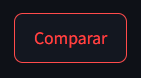

# Reto Qubika: Chatbot especializado en noticias

## Autor

Yuluka Gigante Muriel


## Resumen

Es repositorio contiene la implementación de una aplicación, potenciada por modelos de IA, que permite la interacción con un chatbot espcializado, por medio de una Interfaz Gráfica de Usuario (GUI) web.

La idea del proyecto es la creación de una aplicación que use la técnica Retrieval-Augmented Generation (RAG), para permitir al modelo saber acerca de temas especializados y basar sus respuestas en estos, con la particularidad de que la información para nutrir esta Base de Conocimiento debe extraerse de páginas web de noticias, mediante web scraping. Este proyecto fue propuesto por la empresa [Qubika](https://qubika.com).


## Cómo usar

**Video demostración**: Este [video](https://youtu.be/XtqtYcyASLw) contiene una demostración del funcionamiento del proyecto.

Para usar este proyecto, deberás seguir estos pasos:

1. Instalar las dependencias listadas en `requirements.txt`:

    ```bash
    pip install -r requirements.txt
    ```

    > **Nota**: Este proyecto usa algunas librerías que podrían no interesarte. Si no deseas algunas features, puedes omitir la instalación de las dependencias que estas usan.

2. Obtener las API keys necesarias:

    Este proyecto usa 3 APIs distintas para funcionar: 1) [OpenAI API](https://platform.openai.com/docs/api-reference/introduction), 2) [Groq API](https://console.groq.com/docs/overview), y 3) [Google Cloud Text-to-Speech](https://cloud.google.com/text-to-speech/docs?hl=es-419).

    Por tanto, necesitarás keys de estas 3 APIs. Puedes obtenerlas en:

    - [Groq](https://console.groq.com/keys)
    - [OpenAI](https://platform.openai.com/api-keys)
    - [Google Cloud](https://console.cloud.google.com/apis/dashboard?hl=es-419&inv=1&invt=AbiC4Q&project=jarvis-381306)

    **Nota**: Para poder hacer uso de la API de Google es necesario seguit un par de pasos extras. Recomiendo ver este [video](https://www.youtube.com/watch?v=GVPWz-nhJhg) para poder hacerlo.

    Una vez tengas las keys, crear un archivo `.env` en la raíz del proyecto:

    ```env
    OPENAI_API_KEY=«api key de OpenAI»
    GROQ_API_KEY=«api key de Groq»
    GOOGLE_CLOUD_API_KEY=«ruta al archivo .json con la api key de Google Cloud»
    ```

3. Recolectar las páginas:

    Necesitarás recolectar la URLs de donde deseas extraer la información.

    Este repositorio ya contiene un conjunto de URL preseleccionadas, almacenadas en `source_urls.txt`, que han sido probadas y funcionan bien. Sin embargo, si deseas utilizar páginas diferentes, basta con que sobrescribas las URLs en el archivo mencionado anteriormente.

    **Nota:** Asegúrate de que las páginas que elijas siguen una estructura similar a las que yo elegí. De lo contrario, el scraper no podrá extraer la información. Las noticias que he observado que mejor funcionan son las de los sitios:

    - [El País](https://www.elpais.com.co)
    - [Blu Radio](https://www.bluradio.com)
    - [El Espectador](https://www.elespectador.com)

4. Ejecuta `start_ui.py`:

    Para iniciar la aplicación, ejecuta el siguiente comando:

    ```bash
    streamlit run .\src\start_ui.py
    ```

    Una vez inicia la ejecución de la aplicación, se abrirá en tu navegador y se verá así:

    

    Esta es la página principal, y tiene 3 apartados importantes:

    1. **Barra lateral:**

        

        Acá podrás configurar distintas cosas de la aplicación: 1) el **_modelo de lenguaje_** a usar (junto con su temperatura y lenguaje), 2) la **_voz_** que oirás en cada respuesta (usará el mismo lenguaje seleccionado para el LLM), 3) la **_Base de Conocimientos_** del modelo.

        Deberás presionar el botón `Recargar Chatbot` cada vez que hagas cambios en la configuración del LLM o la voz, para hacerlos efectivos.

        Para configurar la **_Base de Conocimiento_**, debes pegar los URLs de las páginas de las que desees extraer la información en el área de texto dispuesta para ello:
        
        

        Cada URL debe estar separada por una línea en blanco de la anterior.

        Una vez hayas configruado las URLs, deberás presionar el botón `Recargar Base de Conocimiento`. 
        
        **Nota**: Este botón sirve para crear la **_Base de Conocimiento_**, la primera vez, y para sobreescribirla con información de otras fuentes, las siguientes veces.

        El proceso de recargado de la base demorará más o menos en función de la cantidad de páginas que hayas especificado, y creará dos carpetas dentro de tu proyecto:

        - `data`: contiene la información extraída de las páginas web en documentos `.json`. Cada documento corresponde a una página.

        - `db`: contiene la base de datos vectorial (de embeddings) que se usará para la recuperación de la información relevante para cada mensaje que envíes al chatbot.

    2. **Área de Chat:**

        Esta es la zona donde podrás interactuar con el chatbot, mandándole mensajes, y recibiendo sus respuestas.

        Podrás iniciar la conversación una vez hayas configurado la **_Base de Conocimiento_**:

        

        Escucharás cada respuesta del chatbot con la voz que hayas configurado.

    3. **Área de comparación:**

        Puedes acceder a esta zona mediante el botón:

        

        Cuando entres, verás que la ventana cambia a:

        

        Acá podrás llevar a cabo la comparación de dos noticias de fuentes distintas. La idea es comparar la misma noticia, extraída de diferentes fuentes.

        Para poder llevar a cabo la comparación, debes escribir las URLs de las noticias a comparar en los campos dispuestos para ello:

        

        Luego, tendrás que presionar el botón `Comparar`:
        
        

        Este proceso tomará un momento, pues la aplicación realizará el scraping de las páginas especificadas, y creará una nueva carpeta `data/comparison` con la información extraída. Cuando termine, verás el resultado de la siguiente manera:

        

        Si deseas oír alguno de los resúmenes, puedes presionar el botón:

        

        Por lo demás, la composición de esta zona es similar a la anterior, permite la misma configuración del LLM y la voz, y funciona de la misma manera.


¡Espero te resulte útil!